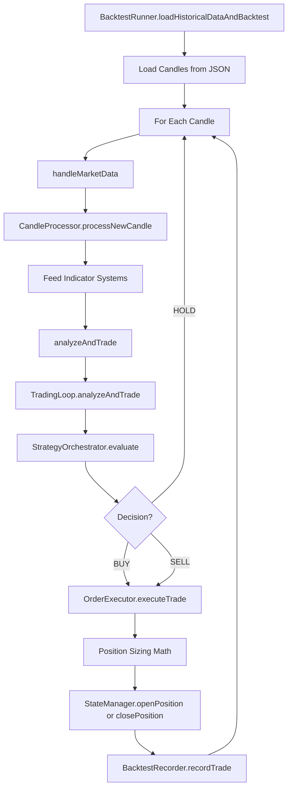

# BACKTEST PIPELINE AUDIT
## Complete Trace of Everything That Produces the "$970 Edge"

**Created: 2026-03-22**
**Purpose: Line-by-line audit of what ACTUALLY happens in backtest**

---

## HIGH-LEVEL FLOW



---

## STEP 1: BACKTEST ENTRY POINT

**File:** `core/BacktestRunner.js`
**Method:** `loadHistoricalDataAndBacktest()`
**Lines:** 29-249

### What Happens:
1. Loads candles from JSON file (line 56)
2. For each candle (line 70):
   - Converts to OHLCV format (lines 74-81)
   - Calls `this.ctx.handleMarketData([...])` (lines 84-94)
   - Waits for warmup (15 candles) then calls `this.ctx.analyzeAndTrade()` (lines 97-99)
3. At end: force-closes any open position (lines 121-127)
4. Prints summary and saves report

### Key Dependencies:
- `ctx.handleMarketData` - bound from run-empire-v2.js
- `ctx.analyzeAndTrade` - bound from run-empire-v2.js
- `ctx.priceHistory` - array that accumulates candles
- `ctx.patternChecker` - pattern memory system

---

## STEP 2: CANDLE PROCESSING

**File:** `core/CandleProcessor.js`
**Method:** `handleMarketData(ohlcData)` → `processNewCandle(candle)`

### handleMarketData (lines 214-378):
1. Parses OHLC array: `[time, etime, o, h, l, c, vwap, vol, count]`
2. Skips stale data check in backtest mode (line 229)
3. Builds candle object: `{ o, h, l, c, v, t, etime }`
4. Calls `processNewCandle(candle)` (line 312)
5. Stores `ctx.marketData = { price, timestamp, volume, etc. }`

### processNewCandle (lines 50-122):
1. Adds candle to `ctx.priceHistory` array
2. Stores in `ctx._candleStore`
3. **FEEDS THESE SYSTEMS:**
   - `ctx.indicatorEngine.updateCandle()` - calculates RSI, EMA, MACD, ATR, etc.
   - `ctx.mtfAdapter.ingestCandle()` - multi-timeframe analysis
   - `ctx.emaCrossover.update()` - EMA/SMA crossover strategy
   - `ctx.maDynamicSR.update()` - MA dynamic support/resistance
   - `ctx.breakAndRetest.update()` - break and retest detection
   - `ctx.liquiditySweep.feedCandle()` - liquidity sweep detection
   - `ctx.volumeProfile.update()` - volume profile analysis
4. Trims history to 250 candles (line 111)

---

## STEP 3: THE DECISION ENGINE

**File:** `core/TradingLoop.js`
**Method:** `analyzeAndTrade()`
**Lines:** 46-574

### Complete Flow:

#### Lines 51-76: Get Current State
```javascript
const { price } = this.ctx.marketData;
const dtoState = this.ctx.indicatorEngine.getSnapshot();
const indicators = dtoState.indicators;
// Backward compat aliases:
indicators.ema12 = indicators.ema9 || price;
indicators.ema26 = indicators.ema21 || price;
indicators.volatility = indicators.atr || 0;
indicators.trend = indicators.superTrendDirection || 'sideways';
```

#### Lines 80-116: Pattern Detection
```javascript
const memoryPatterns = this.ctx.patternChecker.analyzePatterns({
  candles: this.ctx.priceHistory,
  trend: indicators.trend,
  macd: indicators.macd?.macd,
  rsi: indicators.rsi,
  volume: this.ctx.marketData.volume
});
// CandlePatternDetector is DISABLED (line 97)
const rawCandlePatterns = []; // Disabled
const patterns = [...candlePatterns, ...memoryPatterns];
```

#### Lines 169-189: OGZ TPO Oscillator
```javascript
tpoResult = this.ctx.ogzTpo.update({
  o, h, l, c, t
});
```

#### Lines 195-202: Market Regime Detection
```javascript
const _regimeDetector = new RegimeDetector();
const regimeResult = _regimeDetector.detect(indicators, priceHistory);
const regime = {
  currentRegime: regimeResult.regime || 'unknown',
  confidence: regimeResult.confidence || 0
};
```

#### Lines 217-236: STRATEGY ORCHESTRATOR (THE KEY DECISION)
```javascript
const orchResult = this.ctx.strategyOrchestrator.evaluate(
  indicators,
  patterns,
  regime,
  this.ctx.priceHistory,
  {
    emaCrossoverSignal,
    maDynamicSRSignal,
    breakRetestSignal,
    liquiditySweepSignal,
    mtfAdapter,
    tpoResult,
    price,
    fibLevels,
    volumeProfile,
  }
);
```

**Returns:** `{ action, direction, confidence, winnerStrategy, exitContract, sizingMultiplier, confluence, allResults }`

#### Lines 247-256: Direction Filter
```javascript
if (pipeline.directionFilter === 'long_only' && tradingDirection === 'sell') {
  tradingDirection = 'hold'; // Block shorts on spot market
}
```

#### Lines 393-514: Trade Decision Logic
1. Gets position from `stateManager.get('position')`
2. If position exists → checks `exitContractManager.checkExitConditions()`
3. If no position and confidence >= minConfidence:
   - Checks `riskManager.isTradingAllowed()`
   - Checks `riskManager.assessTradeRisk()`
   - If approved → `decision = { action: 'BUY', direction: 'long', confidence }`

#### Line 570: Execute Trade
```javascript
await this.ctx.executeTrade(decision, confidenceData, price, indicators, patterns, traiDecision, orchResult);
```

---

## STEP 4: STRATEGY ORCHESTRATOR

**File:** `core/StrategyOrchestrator.js`
**Method:** `evaluate()`
**Lines:** 608-821

### Registered Strategies:
1. **EMASMACrossover** - EMA/SMA crossover signals
2. **MADynamicSR** - MA dynamic support/resistance
3. **RSI** - RSI oversold/overbought
4. **LiquiditySweep** - Liquidity sweep detection
5. **OGZTPO** - Two-pole oscillator
6. **OpeningRangeBreakout** - ORB detection
7. **MultiTimeframe** - MTF confluence

### Confluence Sizing (lines 60-65):
```javascript
this.confluenceSizing = {
  1: 1.0,   // Single strategy — base size
  2: 1.5,   // Two agree — 1.5x
  3: 2.0,   // Three agree — 2x
  4: 2.5,   // Four+ agree — 2.5x (cap)
};
```

### Evaluation Flow (lines 453-663 in reverted 9e632bf):
1. **Run all strategies independently** (each strategy's evaluate() called)
2. **ATR filter** - Skip if ATR% < minimum
3. **Sort by confidence** (highest first)
4. **Filter by minimum confidence** (minStrategyConfidence threshold)
5. **Winner = highest confidence**
6. **Count confluence** - how many strategies agree on direction
7. **Calculate sizing multiplier**:
```javascript
const cappedCount = Math.min(confluenceCount, 4);
const sizingMultiplier = this.confluenceSizing[cappedCount]; // 1.0 to 2.5x
// NOTE: No regime multiplier in validated code - that was reverted
```
8. **Create exit contract** from winning strategy
9. **Return** `{ action, direction, confidence, winnerStrategy, exitContract, sizingMultiplier, ... }`

**NOTE:** Regime affinities and _positionSizeMultiplier were REVERTED (commit 1b68fa4).
They were silently cutting positions by 40-50% and causing $970 to drop to $575.

---

## STEP 5: POSITION SIZING (THE MONEY MATH)

**File:** `core/OrderExecutor.js`
**Method:** `executeTrade()`
**Lines:** 43-269

### MULTIPLIER 1: Confidence Scaling (lines 55-66)
```javascript
// Base from config
let basePositionPercent = TradingConfig.get('positionSizing.maxPositionSize'); // 5%

// Confidence multiplier: 0.5x to 2.5x
const tradeConfidence = rawConfidence > 1 ? rawConfidence / 100 : rawConfidence;
const confidenceMultiplier = Math.max(0.5, Math.min(2.5,
  0.5 + (tradeConfidence - 0.5) * 4.0
));
basePositionPercent = basePositionPercent * confidenceMultiplier;
```

**Confidence → Multiplier Table:**
| Confidence | Multiplier |
|------------|------------|
| 50% | 0.5x |
| 62.5% | 1.0x |
| 75% | 1.5x |
| 87.5% | 2.0x |
| 100% | 2.5x |

### CAP: Hard limit after confidence (lines 68-73)
```javascript
const maxPositionPercent = TradingConfig.get('positionSizing.maxPositionSize') * 2.5; // 12.5%
if (basePositionPercent > maxPositionPercent) {
  basePositionPercent = maxPositionPercent; // Capped at 12.5%
}
```

### Calculate USD → BTC (lines 77-87)
```javascript
const baseSizeUSD = currentBalance * basePositionPercent;
const positionSizeBTC = baseSizeUSD / price;
const positionSize = positionSizeBTC;
```

### MULTIPLIER 2: Confluence Sizing (lines 228-239)
```javascript
const sizingMultiplier = orchResult?.sizingMultiplier || 1.0;
const adjustedPositionSize = positionSize * sizingMultiplier;
```

### FINAL POSITION MATH:
```
Base: 5% (maxPositionSize from config)
× Confidence Multiplier: 0.5x to 2.5x → max 12.5%
× Cap: Capped at 12.5%
× Confluence Multiplier: 1.0x to 2.5x → max 31.25%

THEORETICAL MAXIMUM: 5% × 2.5 × 2.5 = 31.25% of account
```

---

## STEP 6: STATE MANAGEMENT

**File:** `core/StateManager.js`
**Method:** `openPosition(size, price, context)`
**Lines:** 277-330

### What Gets Stored:
```javascript
const trade = {
  id: tradeId,
  action: 'BUY',
  size: size,           // BTC amount
  price: price,
  entryPrice: price,
  entryTime: Date.now(),
  status: 'open',
  ...context            // includes patterns, indicators, exitContract
};
this.state.activeTrades.set(tradeId, trade);
```

### Balance Update:
```javascript
const usdCost = size * price;
const entryFee = usdCost * TradingConfig.get('fees.makerFee');
updates = {
  position: this.state.position + size,
  balance: this.state.balance - usdCost - entryFee,
  inPosition: this.state.inPosition + usdCost,
};
```

---

## STEP 7: EXIT LOGIC

**File:** `core/ExitContractManager.js`
**Method:** `checkExitConditions(trade, currentPrice, context)`

### Exit Types:
1. **Stop Loss** - price drops below stopLossPercent
2. **Take Profit** - price rises above takeProfitPercent
3. **Trailing Stop** - dynamic stop that follows price up
4. **Time-based** - max hold time exceeded
5. **Trend Reversal** - supertrend flips (if enabled)
6. **DD Circuit Breaker** - max drawdown hit

### Per-Strategy Exit Contracts:
Each strategy has its own SL/TP defaults in `DEFAULT_CONTRACTS`:
```javascript
// ACTUAL LOCKED VALUES from TradingConfig.js (lines 146-194):
EMASMACrossover: { stopLossPercent: -0.5, takeProfitPercent: 1.0 }  // LOCKED - validated
MADynamicSR:     { stopLossPercent: -0.8, takeProfitPercent: 1.0 }  // LOCKED - validated
RSI:             { stopLossPercent: -0.8, takeProfitPercent: 1.0 }  // LOCKED - validated
OGZTPO:          { stopLossPercent: -0.8, takeProfitPercent: 1.0 }  // LOCKED - validated
MultiTimeframe:  { stopLossPercent: -0.8, takeProfitPercent: 1.0 }  // LOCKED - validated
LiquiditySweep:  { stopLossPercent: -2.0, takeProfitPercent: 2.5 }  // Fallback - uses structural exits
```

---

## STEP 8: P&L CALCULATION

**File:** `core/BacktestRecorder.js`
**Method:** `recordTrade(trade)`
**Lines:** 36-116

### Calculation:
```javascript
const entryValue = trade.entryPrice * trade.size;
const exitValue = trade.exitPrice * trade.size;

// Fees (0.26% each way = 0.52% round trip)
const entryFee = entryValue * this.feePerSide;
const exitFee = exitValue * this.feePerSide;
const totalFees = entryFee + exitFee;

// P&L
if (trade.direction === 'long') {
  rawPnlDollars = exitValue - entryValue;
} else {
  rawPnlDollars = entryValue - exitValue;
}
netPnlDollars = rawPnlDollars - totalFees;

// Update balance
this.balance += netPnlDollars;
```

---

## WHAT MODIFIES POSITION SIZE?

| Component | What It Does | Location |
|-----------|--------------|----------|
| `TradingConfig.positionSizing.maxPositionSize` | Base size (5%) | TradingConfig.js |
| Confidence Multiplier | 0.5x to 2.5x based on signal strength | OrderExecutor.js:63-65 |
| Hard Cap | Limits to maxPositionSize × 2.5 (12.5%) | OrderExecutor.js:69-73 |
| Confluence Multiplier | 1.0x to 2.5x based on # strategies agreeing | StrategyOrchestrator.js:727-729 |
| ~~Regime Multiplier~~ | **REVERTED** - was cutting positions 40-50% | Removed in commit 1b68fa4 |

---

## WHAT MODIFIES CONFIDENCE?

| Component | What It Does | Location |
|-----------|--------------|----------|
| Each Strategy's `evaluate()` | Returns 0-1 confidence | StrategyOrchestrator.js |
| Fib Distance Boost | Adds 0.10-0.15 if near fib level | Individual strategy files |
| VP Confluence | Can boost/reduce based on value area | Disabled |
| ~~Regime Affinities~~ | **REVERTED** - was multiplying confidence by regime | Removed in commit 1b68fa4 |

---

## WHAT CAN BLOCK A TRADE?

| Gate | What It Checks | Location |
|------|----------------|----------|
| Warmup | Need 15+ candles before trading | TradingLoop.js:59 |
| ATR Filter | Skip if ATR% < minimum | StrategyOrchestrator.js:656-665 |
| Min Strategy Confidence | Default 0.01 (1%) | StrategyOrchestrator.js:49 |
| Min Trade Confidence | From config | TradingLoop.js:398 |
| Direction Filter | long_only blocks shorts | TradingLoop.js:247-256 |
| RiskManager.isTradingAllowed() | Checks daily loss limits | TradingLoop.js:477-480 |
| RiskManager.assessTradeRisk() | Full risk assessment | TradingLoop.js:483-489 |
| Same-direction block | Can't stack same direction | TradingLoop.js:466-467 |
| Max positions limit | Default 3 concurrent | TradingLoop.js:404 |

---

## SUMMARY: THE $970 EDGE WAS BUILT ON

1. **5% base position** (maxPositionSize from TradingConfig)
2. **× Confidence multiplier** up to 2.5x → max 12.5%
3. **× Confluence multiplier** up to 2.5x → max 31.25% of account
4. **Strategy-specific exit contracts** (LOCKED values: SL -0.5% to -0.8%, TP 1.0%)
5. **Zero fees for stock mode** (--stocks flag)

**NOTE:** Regime-adjusted position sizing was REVERTED. It was not part of the validated $970 run.

**CRITICAL FINDING:** The validated results used positions up to **31.25% of account** on high-confidence, high-confluence trades. This is NOT a conservative 1-5% position size system.

---

## KNOWN ISSUES IDENTIFIED

1. **BTC naming in stock trading code** - Variable names say "BTC" but math works for stocks
2. ~~No percentage logging~~ - **FIXED**: TRADE-RECEIPT now logs every trade with actual $ and %
3. **Two stacking multipliers** - Confidence × Confluence = up to 6.25x total (2.5 × 2.5)
4. **DynamicPositionSizer not wired** - Exists but using inline logic instead

---

## REVERTED FEATURES (Not in validated code)

1. **Regime Affinities** - Cut positions 40-50% in volatile/dead markets (reverted 1b68fa4)
2. **DynamicPositionSizer wiring** - Used 1% base instead of 5% (reverted 924f01f)
3. **MarketRegime as strategy** - Converted to pre-filter then reverted

---

## AUDIT COMPLETED

- [x] Position percentage logging added (TRADE-RECEIPT)
- [x] Exit contracts verified against TradingConfig (LOCKED values confirmed)
- [x] Regime pre-filter reverted (was cutting positions silently)
- [ ] Each strategy's evaluate() function needs individual tracing
- [ ] Compare backtest fees to live broker fees

